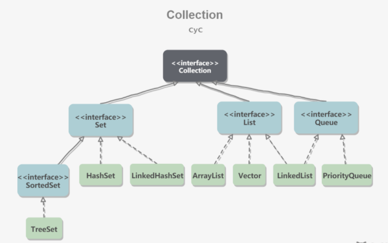
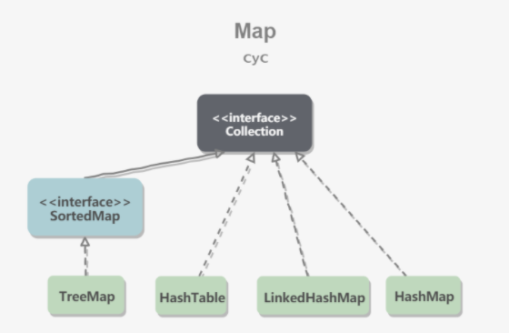
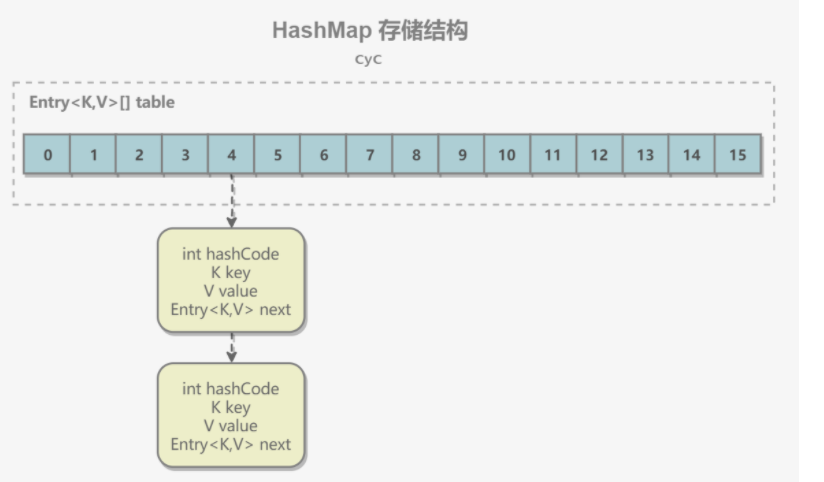

collection继承了iterable接口
## Set
	• TreeSet：基于红黑树实现，支持有序性操作，例如根据一个范围查找元素的操作。但是查找效率不如 HashSet，HashSet 查找的时间复杂度为 O(1)，TreeSet 则为 O(logN)。
	• HashSet：基于哈希表实现，支持快速查找，但不支持有序性操作。并且失去了元素的插入顺序信息，也就是说使用 Iterator 遍历 HashSet 得到的结果是不确定的。
	• LinkedHashSet：具有 HashSet 的查找效率，并且内部使用双向链表维护元素的插入顺序。
## List
	• ArrayList：基于动态数组实现，支持随机访问。
	• Vector：和 ArrayList 类似，但它是线程安全的。
	• LinkedList：基于双向链表实现，只能顺序访问，但是可以快速地在链表中间插入和删除元素。不仅如此，LinkedList 还可以用作栈、队列和双向队列。
## Queue
	• LinkedList：可以用它来实现双向队列。
	• PriorityQueue：基于堆结构实现，可以用它来实现优先队列。

来自 <https://github.com/CyC2018/CS-Notes/blob/master/notes/Java%20%E5%AE%B9%E5%99%A8.md> 

## map

图最上面应该是map接口
• TreeMap：基于红黑树实现。
• HashMap：基于哈希表实现。
• HashTable：和 HashMap 类似，但它是线程安全的，这意味着同一时刻多个线程同时写入 HashTable 不会导致数据不一致。它是遗留类，不应该去使用它，而是使用 ConcurrentHashMap 来支持线程安全，ConcurrentHashMap 的效率会更高，因为 ConcurrentHashMap 引入了分段锁。
• LinkedHashMap：使用双向链表来维护元素的顺序，顺序为插入顺序或者最近最少使用（LRU）顺序。
map 已经有了getOrDefault()

# 源码分析
## ArrayList
因为 ArrayList 是基于数组实现的，所以支持快速随机访问。RandomAccess 接口标识着该类支持快速随机访问。就是不用遍历就知道那个了啊
## LinkedList：双向链表
## HashMap1.7
	1. 存储结构：
	
	数组+链表
	hashmap默认大小16，计算hashcode再使用除留余数法，相同插在前面
	查找就先计算hashcode，再在链表上顺序查找，所以时间复杂度O（N）
	扩容是将capacity扩大一倍，因为不同的hash值和（n-1）进行位运算能够得到不同的值；(n-1)&hash=hash%n
	从 JDK 1.8 开始，一个桶存储的链表长度大于等于 8 时会将链表转换为红黑树。
	解决哈希冲突常用的两种方法是：开放定址法和链地址法
	
	ConcurrentHashMap 和 HashMap 实现上类似，最主要的差别是 ConcurrentHashMap 采用了分段锁（Segment），每个分段锁维护着几个桶（HashEntry），多个线程可以同时访问不同分段锁上的桶，从而使其并发度更高（并发度就是 Segment 的个数）。
	JDK 1.7 使用分段锁机制来实现并发更新操作，核心类为 Segment，它继承自重入锁 ReentrantLock，并发度与 Segment 数量相等。
	JDK 1.8 使用了 CAS 操作来支持更高的并发度，在 CAS 操作失败时使用内置锁 synchronized。
并且 JDK 1.8 的实现也在链表过长时会转换为红黑树。