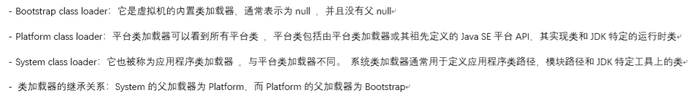

## 类加载机制

类的加载：读取字节码并创建一个java.lang.Class对象
类的连接：检验类内部结构正确；为类变量分配内存，并设置默认初始值；将类的二进制数据中符号引用替换为直接引用
类的初始化：对类变量初始化，如果直接父类还没有初始化，先初始化父类

JVM类加载机制：全盘负责，父类委托，缓存机制
java中的内置类加载器：

## 内存空间

java虚拟机的内存空间：

> 栈内存：

存储运行的方法、局部变量（对象的地址）

每一个线程都会有自己独立的栈内存空间

> 堆内存：

存储对象和成员方法的引用地址

堆内存中的数据是被多个线程共享的

> 方法区

.class文件加载时进入的内存

有静态和非静态区，

保存成员方法

*4.本地方法区：主要调用操作系统相关资源

*5.寄存器：交给cpu进行使用

## 垃圾回收机制
